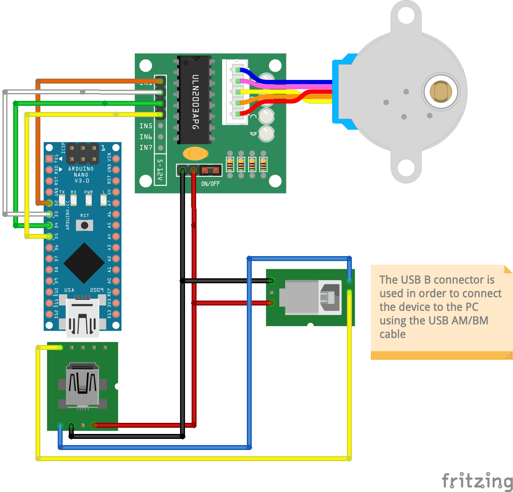
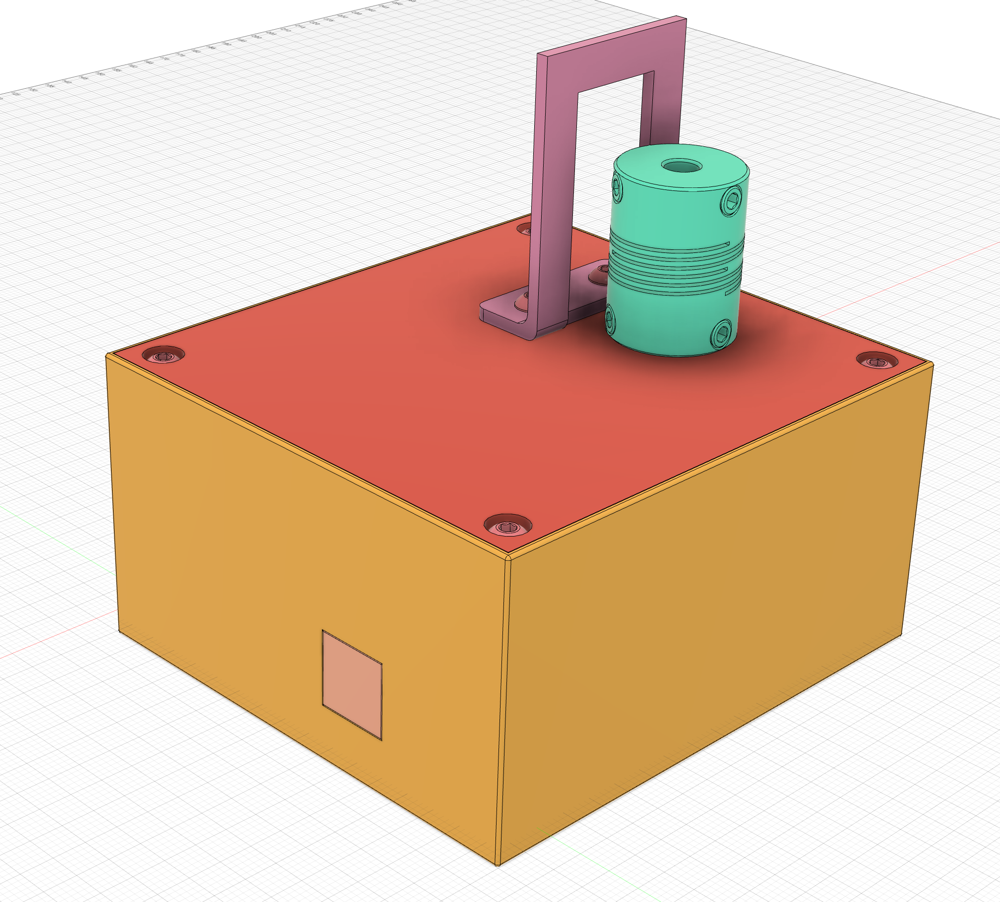
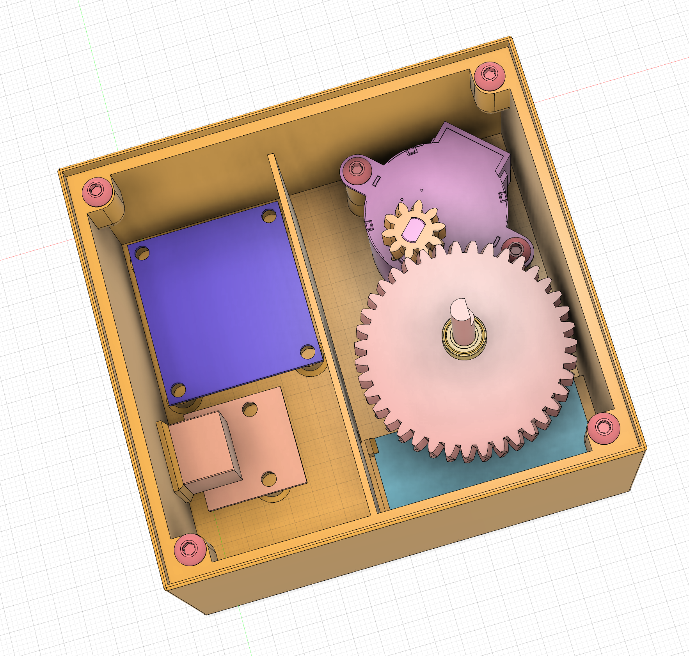
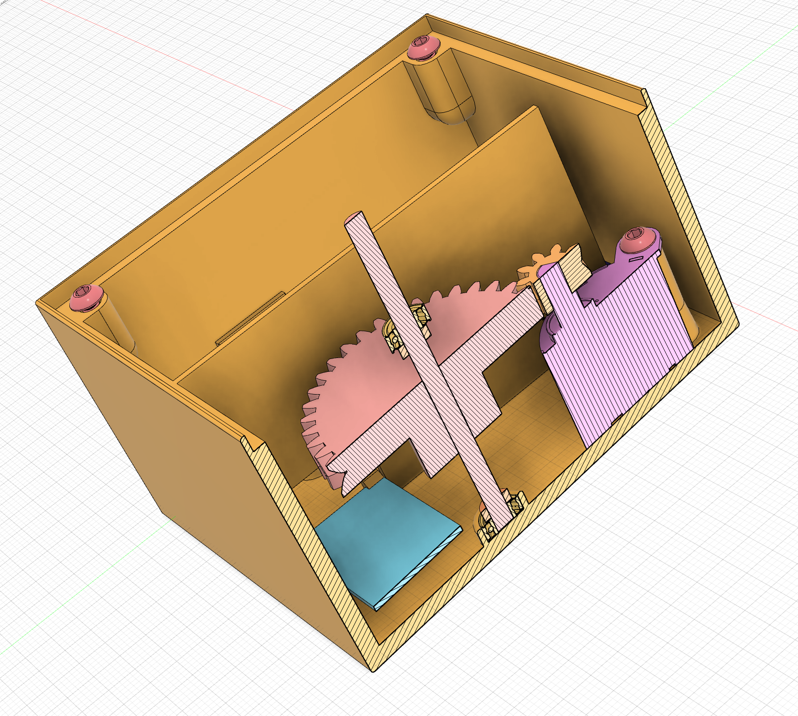
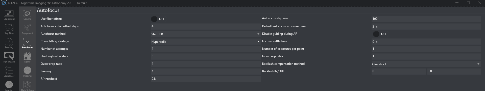
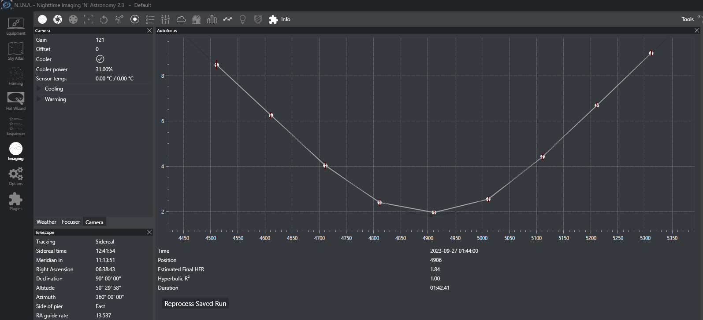

# SHSimpleFocuser

Quite a simple yet workable ASCOM-compatible handmade automatic focuser.

### Technical characteristics

The driving part of the focuser is a 28BYJ-48 stepper motor which needs 5V of
power and it draws only about 240 mA of the current. Such characteristics of
the motor give an ability to use the USB connection to power the motor.
[Here](https://lastminuteengineers.com/28byj48-stepper-motor-arduino-tutorial/)
is a good overview of that stepper motor.

According to that article in full step mode the motor does `2038` steps per
revolution. Bearing in mind that the gear ratio is `1:4` the total number of
steps in order to the focuser's output shaft to make the full revolution is
`2038 * 4 => 8152`.

The article also mentions the torque of the stepper motor - `34.3 mN*m` which
roughly corresponds to the `350 g*force*cm`. Again, using the gear ratio of
`1:4` the torque of the output shaft is about `1.4 kg*force*cm`. Which is quite
okay, but ideally it's better to have a better margin between the minimum
required value and the maximum torque the focuser can supply. I weighted all
the imaging train I put into the focuser and it weights about `700-800 g`, so
having about `1.4 kg*force*cm` torque from the focuser (and some torque we lose
due to friction, etc.) might be not enough - actually, when tightening focuser
screws up I noticed the focuser almost stopped moving and just skipped steps 😬
Therefore, it's better to have a bigger margin - I believe, something 2x and
higher should be a sweet spot.

I think I'll rebuild the focuser entirely reusing some of the 12V stepper
motors, which initially might provide the `1.4 kg*force*cm` torque and adding
some gear system we can drastically increase it. The downside of this we'll
need additional wiring to provide a 12V power supply, but anyway we already get
it right to the camera, so it's not an issue.

### Breadboard Schematic

### 3D Design

Under the 3DDesign folder there is a [Fusion 360 design
file](./3DDesign/simple-focuser.f3z). Basically, during the design
phase the focuser looked like the following:

 

 

### N.I.N.A: Autofocus setup

The N.I.N.A. astrophotography software provides the autofocusing feature and
now having the automated focuser it makes sense to setup the autofocus. There
is a great [video](https://www.youtube.com/watch?v=lHrfaR7A0L0) about how to
setup auto-focus in N.I.N.A. quickly and correctly. I tried to follow mentioned
steps and that's how the autofocus setup looks in my case:

Once applied all the settings the autofocus routine went correctly and the
graph looks quite great:

